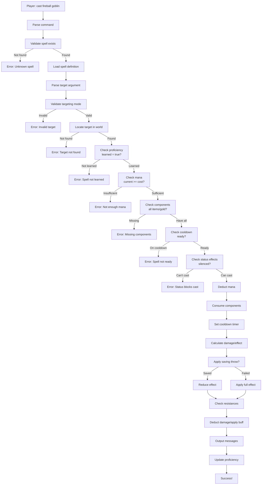

# NJATA System Architecture Diagrams

## Data Flow: Casting a Spell



## Class Hierarchy

```
Skill (interface)
├── Spell
│   ├── OffensiveSpell (damage)
│   ├── HealingSpell (restore HP)
│   ├── DebuffSpell (apply negative affect)
│   ├── BuffSpell (apply positive affect)
│   ├── UtilitySpell (information/movement)
│   └── ControlSpell (teleport/gate/summon)
├── Skill (trained ability)
│   ├── MeleeSkill
│   ├── DefenseSkill
│   └── CraftSkill
├── Weapon (proficiency)
├── Racial (innate ability)
├── Tongue (language)
└── Craft (crafting recipe)
```

## Data Model: Complete Spell

```
Spell (root)
├── Metadata
│   ├── id: int
│   ├── name: string
│   ├── category: string
│   └── type: string
│
├── Requirements
│   ├── level_required: int
│   ├── components: [Component]
│   ├── status_restrictions: [string]
│   └── applicability: {classes, races, restrictions}
│
├── Resource Cost
│   ├── mana_cost: int
│   ├── cooldown_seconds: int
│   └── cooldown_category: string
│
├── Targeting
│   ├── mode: string
│   ├── max_range: int
│   ├── requires_los: bool
│   └── area_radius: int
│
├── Effects
│   ├── damage: DamageEffect
│   ├── healing: HealingEffect
│   ├── affect: AffectEffect
│   └── area_of_effect: AreaInfo
│
├── Success Conditions
│   ├── base_rate: int
│   ├── scales_with: [string]
│   ├── save_type: string
│   └── resistances: [string]
│
├── Messaging
│   ├── cast_by_caster: string
│   ├── cast_by_room: string
│   ├── hit_target: string
│   ├── miss_target: string
│   ├── immune_message: string
│   ├── resisted_message: string
│   └── variables: {$actor, $target, $damage}
│
└── Logistics
    ├── teaching_cost: int
    ├── learning_experience: int
    └── proficiency_cap: int
```

## Player Spell State Tracking

```
Player
├── Spells: Map[SpellID] → PlayerSpellProgress
│   ├── proficiency: 0-100
│   ├── learned: bool
│   ├── learned_at: timestamp
│   ├── lifetime_casts: int
│   └── last_cast: timestamp
│
├── Cooldowns: Map[SpellID] → Unix Nanosecond Timestamp
│   ├── spell_1001 → 1708151890000000000
│   ├── spell_1002 → 1708151410000000000
│   └── (expiration checked on cast attempt)
│
├── Active Affects: [ActiveAffect]
│   ├── affect_name: "strength_buff"
│   ├── applied_by: "spell_1005"
│   ├── expires_at: timestamp
│   ├── duration_remaining: int
│   ├── stat_mods: {strength: +2}
│   ├── ac_bonus: -5
│   └── damage_mods: +1
│
└── Casting State
    ├── is_casting: bool
    ├── current_spell: SpellID
    ├── cast_time_remaining: milliseconds
    ├── queued_spell: SpellID (optional)
    └── queued_target: string (optional)
```

## Spell Loading & Initialization

```
Boot Server
│
├── Load Skills JSON
│   ├── skills/spells.json
│   ├── Parse all spell definitions
│   ├── Validate spell schemas
│   └── Index by ID and name → SkillRegistry
│
├── Load Classes JSON
│   ├── Map class names to IDs
│   └── Load class spell lists
│
├── Load Races JSON
│   ├── Map race names to IDs
│   └── Load racial ability lists
│
├── Initialize Spell Cache
│   ├── Populate GetSpell(id) lookup
│   ├── Populate GetSpellsByClass(class) cache
│   └── Populate GetSpellsByName(name) cache
│
└── Ready for player login
    ├── Players load their proficiency
    ├── Auto-learn class spells
    └── Ready to cast!
```

## Combat Integration Flow

```
Player attacks enemy
│
├── Use equipped weapon attack
│   └── Roll to-hit, deal damage
│
├── OR cast offensive spell
│   ├── Select spell (fireball)
│   ├── Select target/area
│   ├── Calculate damage formula
│   │   └── "4d8 + int_bonus + (proficiency * 0.5)"
│   ├── Target makes save?
│   │   ├── Success: damage * 0.5
│   │   └── Failure: full damage
│   ├── Target resists?
│   │   ├── Immune: damage = 0
│   │   ├── Resistant: damage * 0.5
│   │   └── Susceptible: damage * 1.5
│   ├── Apply damage to target
│   │   └── Trigger enemy response
│   └── Award experience to caster
│
└── OR cast buff spell
    ├── Apply positive affect to self/allies
    ├── Track duration
    └── Show stat bonuses
```

## Damage Calculation Pipeline

```
Base Formula: "4d8 + I + (proficiency / 20)"
│
├─ Roll Dice: 4d8 = 18
├─ Add INT Bonus: +5 (INT 18 → +4, racial bonus +1)
├─ Add Proficiency: 50% proficiency → +2.5
│   Result: 18 + 5 + 2.5 = 25.5 → 25 damage
│
├─ Target Saving Throw
│   ├── Reflex DC 14
│   ├── Target rolls: 1d20 + reflex bonus
│   ├── 16 + 2 = 18 → SUCCESS
│   └── Damage reduced: 25 * 0.5 = 12
│
├─ Check Resistances
│   ├── Fire resist 25%: 12 * 0.75 = 9
│   
├─ Check Immunities
│   ├── Not immune: apply full damage
│   
└─ Final Damage: 9 (after save + resist)
```

## Ability Trees (Future Planning)

```
Total Spell Path:

Novice Mage (Level 1)
├── Magic Missile (2 mana, 1s cooldown)
├── Spark (1 mana, 0.5s cooldown)
└── Mage Armor (10 mana, 30s duration)

Apprentice Mage (Level 5)
├── Previous spells +
├── Fireball (30 mana, 5s cooldown)
├── Frost Bolt (25 mana, 4s cooldown)
└── Invisibility (20 mana, 2m duration)

Journeyman Mage (Level 10)
├── Previous spells +
├── Lightning Bolt (40 mana, 4s cooldown)
├── Teleport (50 mana, 30s cooldown)
├── Identify (15 mana, instant)
└── Dispel Magic (35 mana, instant)

Master Mage (Level 15+)
├── All previous spells +
├── Meteor Storm (100 mana, 15s cooldown)
├── Time Stop (150 mana, 1m cooldown)
└── Gate (75 mana, 60s cooldown)
```

## Performance Considerations

```
Spell Lookup: O(1)
├── SpellRegistry map[int]*Spell
├── SpellsByName map[string]int
└── Get spell definition: < 1μs

Proficiency Lookup: O(1)
├── Player.Skills map[int]PlayerSkillProgress
└── Get player progress: < 1μs

Cooldown Check: O(1)
├── Player.SkillCooldowns map[int]int64
├── Compare to current time
└── Check ready: < 1μs

Casting Full Flow:
├── Lookup: 10 lookups × 1μs = 10μs
├── Validation: 50μs
├── Formula eval: 100-500μs (depends on formula complexity)
├── Damage application: 50μs
└── Total: ~200-600μs (< 1ms)

Caching Strategy:
├── Spell definitions: Loaded once at boot, never reloaded in-game
├── Class spell lists: Cached at boot by class ID
├── Proficiency data: Loaded per player, persisted to disk
└── Active affects: In-memory only during play session
```

